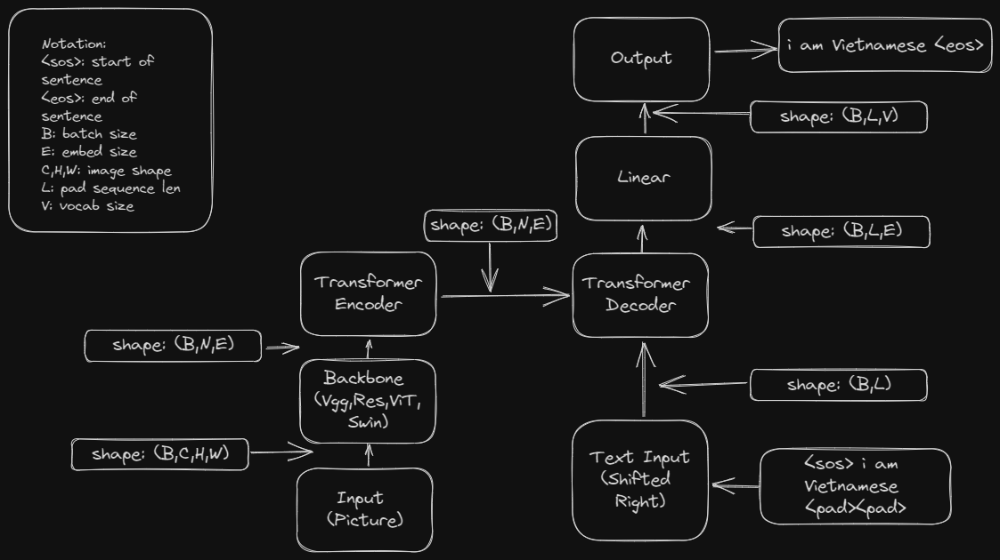

## Model



## Docker

### Build Image
```
docker build -t ocr-project
```
### Test Image
**GPU:**
```
docker run --gpus all -it --rm ocr-project
```

**Non-GPU:**
```
docker run-it --rm ocr-project
```


### Train
```
docker run --gpus all -it --rm ocr-project python train.py --src SRC --target TARGET [--model MODEL] [--config CONFIG]
```
```
SRC:    path/to/image_folder
TARGET: path/to/target.txt
MODEL:  "swin" or "resnet"
CONFIG: "swin_config" or "resnet_config"
```
### Predict
```
docker run --gpus all -it --rm ocr-project python train.py [--model_path MODEL_PATH] [--type TYPE] --img_path IMG_PATH
```

```
MODEL_PATH: path/to/model.pt
TYPE: "batch" or "single"
IMG_PATH : path/to/img_folder(batch) or path/to/img_file(single) 
```