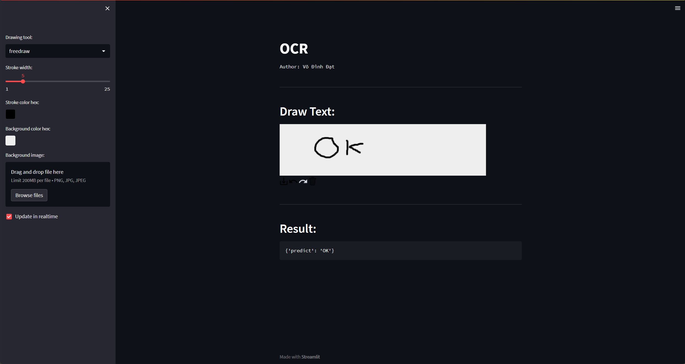

## Table of Contents

* 1. [`Requirement`](#Requirement)
* 2. [`Local`](#Local)
    	* 2.1. [`Train`](#Train)
    	* 2.2. [`Predict`](#Predict)
    	* 2.3. [`Streamlit`](#Streamlit)
* 3. [`Docker`](#Docker)
    	* 3.1. [`Build Image`](#BuildImage)
    	* 3.2. [`Test Image`](#TestImage)
    	* 3.3. [`Train`](#Train-1)
    	* 3.4. [`Predict`](#Predict-1)


##  1. <a name='Requirement'></a>Requirement
```
albumentations==1.3.1
opencv-python==4.8.0.76
opencv-python-headless==4.8.0.76
torch==2.0.1
torchaudio==2.0.2
torchview==0.2.6
torchvision==0.15.2
streamlit
numpy
```

##  2. <a name='Local'></a>Local
```
pip install -r requirements.txt
```

###  2.1. <a name='Train'></a>Train
```
python train.py --src SRC --target TARGET [--model MODEL] [--config CONFIG]
```

###  2.2. <a name='Predict'></a>Predict
```
python predict.py [--model_path MODEL_PATH] [--type TYPE] --img_path IMG_PATH
```

###  2.3. <a name='Streamlit'></a>Streamlit
```
streamlit run app.py
```

##  3. <a name='Docker'></a>Docker

###  3.1. <a name='BuildImage'></a>Build Image
```
docker build -t ocr-project
```
###  3.2. <a name='TestImage'></a>Test Image
**GPU:**
```
docker run --gpus all -it --rm ocr-project
```

**Non-GPU:**
```
docker run-it --rm ocr-project
```


###  3.3. <a name='Train-1'></a>Train
```
docker run --gpus all -it --rm ocr-project python train.py --src SRC --target TARGET [--model MODEL] [--config CONFIG]
```
```
SRC:    path/to/image_folder
TARGET: path/to/target.txt
MODEL:  "swin" or "resnet"
CONFIG: "swin_config" or "resnet_config"
```
###  3.4. <a name='Predict-1'></a>Predict
```
docker run --gpus all -it --rm ocr-project python predict.py [--model_path MODEL_PATH] [--type TYPE] --img_path IMG_PATH
```

```
MODEL_PATH: path/to/model.pt
TYPE: "batch" or "single"
IMG_PATH : path/to/img_folder(batch) or path/to/img_file(single) 
```